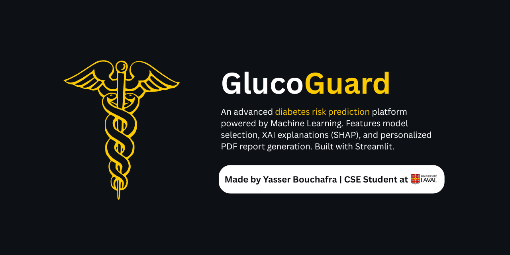
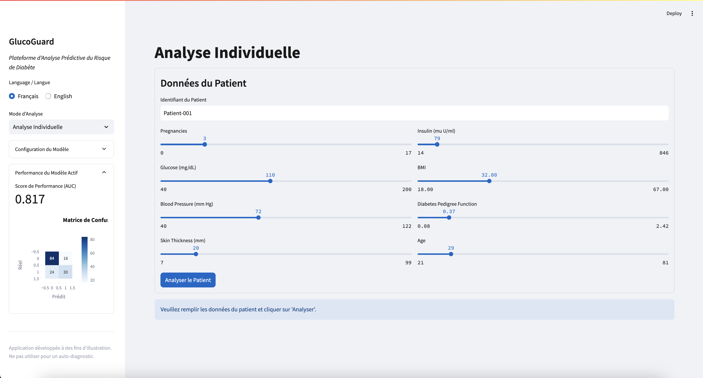
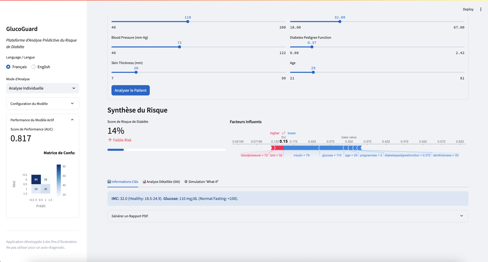
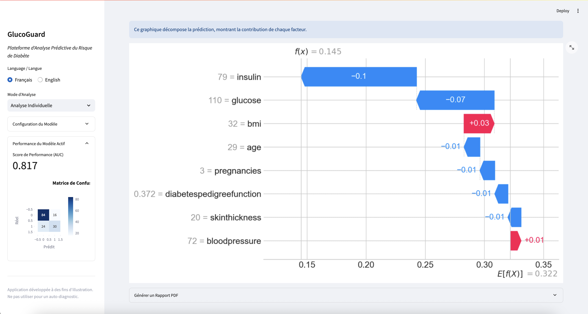
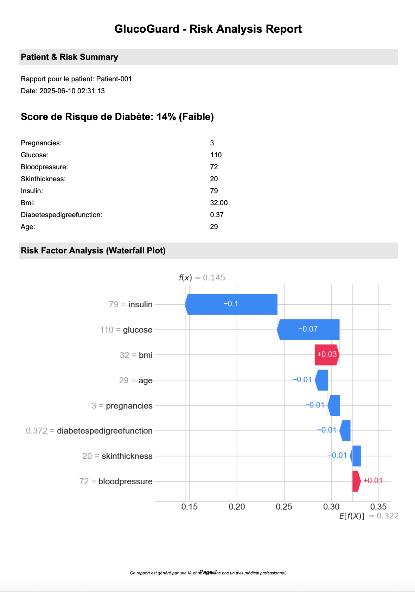
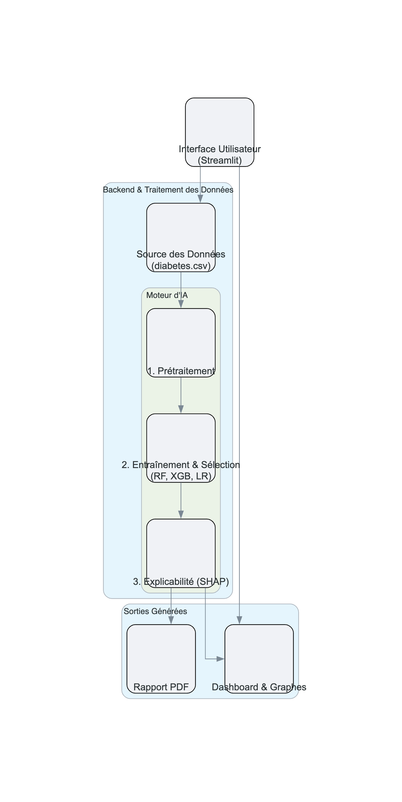
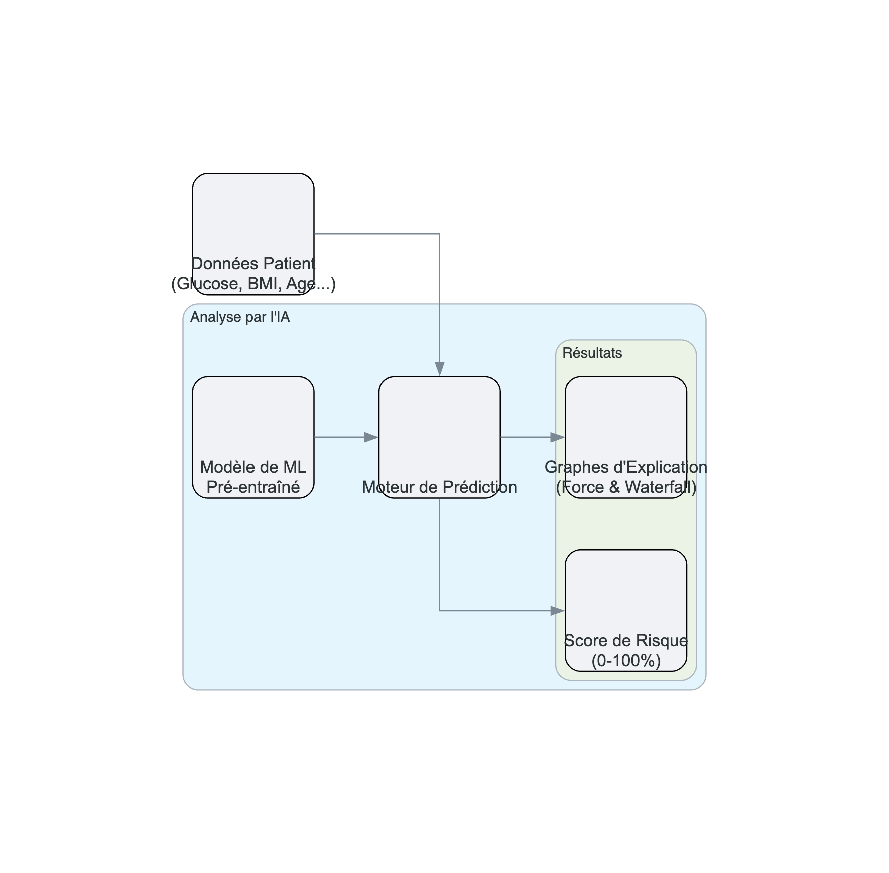

<p align="center">
  
</p>

# GlucoGuard ⚕️


[](https://www.python.org/)
[](https://streamlit.io)
[](https://scikit-learn.org/)
[](https://shap.readthedocs.io/en/latest/)
[](https://opensource.org/licenses/MIT)

**GlucoGuard** est une plateforme web d'analyse prédictive de qualité professionnelle, conçue pour évaluer le risque de diabète à partir de données médicales. Elle intègre des modèles de Machine Learning, des outils d'explicabilité (XAI), et des fonctionnalités avancées telles que la génération de rapports PDF et le support multilingue.

Cette application a été développée comme un outil d'aide à la décision pour les professionnels de santé et un outil pédagogique pour les patients, permettant de visualiser et de comprendre les facteurs de risque de manière interactive.

---

## Fonctionnalités Clés

-   **Interface Professionnelle et Épurée :** Une UI conçue pour être simple, intuitive et sobre, adaptée à un contexte médical.
-   **Support Multilingue :** Changez la langue de l'interface entre le Français et l'Anglais en un clic.
-   **Modes d'Analyse Flexibles :**
    -   **Analyse Individuelle :** Évaluez le risque pour un seul patient via un formulaire interactif.
    -   **Analyse par Lot :** Importez un fichier CSV pour analyser une cohorte de patients en une seule fois.
-   **Choix de Modèles d'IA :** Sélectionnez et comparez les prédictions de trois modèles reconnus : Random Forest, XGBoost, et Régression Logistique.
-   **Explicabilité Avancée (XAI) :**
    -   **Force Plot :** Visualisez les forces qui poussent le risque à la hausse ou à la baisse.
    -   **Waterfall Plot :** Décomposez la prédiction pour voir la contribution de chaque facteur de risque.
-   **Simulation "What-If" :** Modifiez interactivement les facteurs de risque (IMC, Glucose) pour voir leur impact en temps réel sur le score de risque.
-   **Génération de Rapports PDF :** Créez et téléchargez des rapports d'analyse complets et personnalisés pour chaque patient, incluant les données, le score de risque et les graphiques d'analyse.

---

## Galerie

<table>
  <tr>
    <td align="center"><b>Formulaire d'Analyse Individuelle</b></td>
    <td align="center"><b>Résultats et Synthèse du Risque</b></td>
  </tr>
  <tr>
    <td></td>
    <td></td>
  </tr>
  <tr>
    <td align="center"><b>Analyse Détaillée (XAI)</b></td>
    <td align="center"><b>Rapport PDF Généré</b></td>
  </tr>
  <tr>
    <td></td>
    <td></td>
  </tr>
</table>

---

## Architecture de l'Application

Le diagramme ci-dessous illustre le flux de données et le fonctionnement global de la plateforme GlucoGuard, de l'entrée des données à la génération des résultats.



### Processus de Prédiction et d'Explicabilité

Pour chaque analyse individuelle, l'application suit un processus rigoureux pour non seulement prédire le risque, mais aussi pour expliquer sa décision de manière transparente.



---

## Stack Technique

-   **Framework Web :** [Streamlit](https://streamlit.io/)
-   **Analyse de Données :** [Pandas](https://pandas.pydata.org/), [NumPy](https://numpy.org/)
-   **Modèles de Machine Learning :** [Scikit-learn](https://scikit-learn.org/), [XGBoost](https://xgboost.ai/)
-   **Explicabilité (XAI) :** [SHAP](https://shap.readthedocs.io/en/latest/)
-   **Visualisation de Données :** [Plotly](https://plotly.com/), [Matplotlib](https://matplotlib.org/)
-   **Génération de Diagrammes :** [Diagrams](https://diagrams.mingrammer.com/)
-   **Génération de PDF :** [fpdf2](https://pyfpdf.github.io/fpdf2/)

---

## Installation et Lancement

Pour lancer l'application localement, suivez ces étapes :

**1. Prérequis**
- Assurez-vous d'avoir Python 3.8+ installé.
- [Git](https://git-scm.com/downloads) doit être installé sur votre système.

**2. Cloner le Dépôt**
```bash
git clone https://github.com/yasserbouchafra/Diabete-Prediction-ML-Model.git
cd GlucoGuard-Diabetes-Prediction-Platform
```

**3. Créer un Environnement Virtuel (Fortement Recommandé)**
Cela isole les dépendances de votre projet et évite les conflits.
```bash
# Pour Windows
python -m venv venv
venv\Scripts\activate

# Pour macOS/Linux
python3 -m venv venv
source venv/bin/activate
```

**4. Installer les Dépendances**
Le fichier `requirements.txt` contient la liste de toutes les bibliothèques nécessaires. Installez-les en une seule commande :
```bash
pip install -r requirements.txt
```

**5. Lancer l'Application**
Assurez-vous d'être dans le dossier racine du projet, puis exécutez :
```bash
streamlit run gluco_guard_app.py
```
L'application devrait s'ouvrir automatiquement dans votre navigateur.

---

## Structure du Projet

```
.
├── .streamlit/
│   └── config.toml      # Fichier de thème pour l'apparence de l'UI
├── assets/
│   ├── architecture-workflow.png
│   ├── prediction-process.png
│   └── ...              # Autres images et captures d'écran
├── diabetes.csv         # Le dataset utilisé pour l'entraînement
├── gluco_guard_app.py   # Le code source principal de l'application
├── requirements.txt     # La liste des dépendances Python
├── .gitignore           # Fichiers à ignorer par Git
├── LICENSE              # La licence du projet
└── README.md            # Ce fichier
```

---

## License

Ce projet est sous licence MIT. Voir le fichier `LICENSE` pour plus de détails.

---

## 👤 Auteur

**Yasser Bouchafra**

*   **GitHub** : [@yasserbouchafra](https://github.com/yasserbouchafra)
*   **LinkedIn** : [Yasser Bouchafra](https://www.linkedin.com/in/yasser-bouchafra-b1b17b313/)
